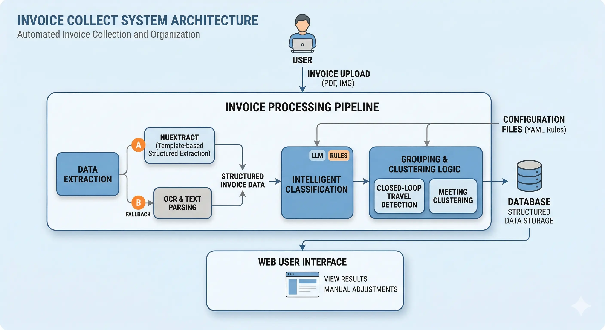

# Invoice Collect 🧾

**Language**: [English](./README.en.md) · [中文](./README.md)

A full-stack invoice management system with automatic structured extraction, intelligent categorization, and clustering for business travel and meetings.

---

## Introduction

**Problem**: Sorting invoices for reimbursement is tedious. This project uses AI and a rules engine to extract structured fields from invoices and cluster them by real-world workflows (e.g. trips, meeting batches), cutting manual effort.

## Key features

- **Two-stage extraction**: NuExtract plus OCR fallback (RapidOCR / Tesseract / EasyOCR) for reliable field recognition across invoice types.
- **Travel closure**: Chains cities and timestamps to group trains, flights, hotels, ride-hailing, etc. into a single “trip”.
- **Smart clustering**: Heuristics (same seller + same day) plus LLM-assisted detection for batches such as meetings.
- **Manual override**: Drag-and-drop in the UI to fix edge cases and complex reimbursement scenarios.

## Showcase

### 1. Architecture overview



### 2. Main UI and upload


### 3. Grouping and drag-and-drop


## Quick start

### Prerequisites

- **Python** >= 3.9
- **API key** (optional, recommended): OpenAI-compatible LLM API for better classification and meeting grouping.
- **NuExtract** (optional): For strong structured extraction, run your own NuExtract service; otherwise the app falls back to local OCR.

### Installation

```bash
# 1. Clone
git clone https://github.com/Gaaaaam/invoice_collect.git
cd invoice_collect

# 2. Dependencies
pip install -r requirements.txt

# 3. Configuration
# Defaults ship with the repo. Adjust files under config/ as needed (e.g. models.yml, travel.yml).
# Important: set LLM and extraction endpoints in config/models.yml, or configure later in the UI.

# 4. Run
python main.py
# Production-style: uvicorn main:app --host 127.0.0.1 --port 8088
```

Open `http://127.0.0.1:8088/`.

### Docker

Build and run with Docker Compose (data persisted in a named volume):

```bash
# Optional: copy .env.example to .env and set LLM / NuExtract overrides
docker compose up -d --build
```

The app listens on port **8088**. Environment variables such as `INVOICE_COLLECT_LLM_*` and `INVOICE_COLLECT_NUEXTRACT_*` override `config/models.yml` when set (see `.env.example` and `docker-compose.yml`).

## Feature deep-dive

### Travel “closure” logic

Trip grouping is not only time-based. With `home_city` in `config/travel.yml` as the reference:

- Leaving `home_city` on a transport invoice (e.g. rail, flight) starts a trip.
- Further transport invoices extend the chain.
- Returning to `home_city` closes the loop.
- Lodging and local transport (e.g. taxis) in that window attach to the same closed trip.

### NuExtract two-stage templates

For many Chinese invoice layouts, `config/nuextract_templates.json` drives a two-step flow:

1. **Type detection**: Infer invoice subtype (e.g. rail e-ticket, air itinerary).
2. **Targeted extraction**: Apply the matching schema from the JSON templates for higher accuracy. New types can be added by editing the JSON only.

## Configuration

Most behavior is controlled by YAML/JSON under `config/`.

| File | Purpose |
|------|---------|
| `models.yml` | LLM base URL, API key, NuExtract host/port, OCR engine choice, etc. |
| `rules.yml` | Rule engine: “if field matches X, assign category Y”. |
| `categories.yml` | Reimbursement categories (travel, meeting, materials, …) and whether grouping is allowed. |
| `travel.yml` | Travel settings, including `home_city`. |
| `nuextract_templates.json` | Per-type structured extraction schemas. |

### Example: custom rule (`rules.yml`)

```yaml
- id: rule_hotel_to_travel
  name: Map lodging to travel
  priority: 20
  conditions:
  - field: invoice_type
    match_type: contains
    value: 住宿
  - field: seller_name
    match_type: regex
    value: (酒店|宾馆|旅馆|民宿|客栈)
  condition_logic: OR
  target_category: travel
```

## Tech stack

- **Backend**: FastAPI, SQLAlchemy 2 (async), SQLite  
- **Frontend**: Jinja2, HTML5, vanilla JS, CSS3  
- **AI**: OpenAI-compatible APIs, NuExtract (async HTTP client), RapidOCR / Tesseract / EasyOCR  

## Roadmap

- More electronic document types (e.g. direct PDF itinerary parsing).
- Export reimbursement packs (Excel / PDF).
- First-class support for more domestic LLMs (e.g. Qwen, DeepSeek).
- Improved mobile browsing (planned).

## License

[Apache 2.0 License](LICENSE)
