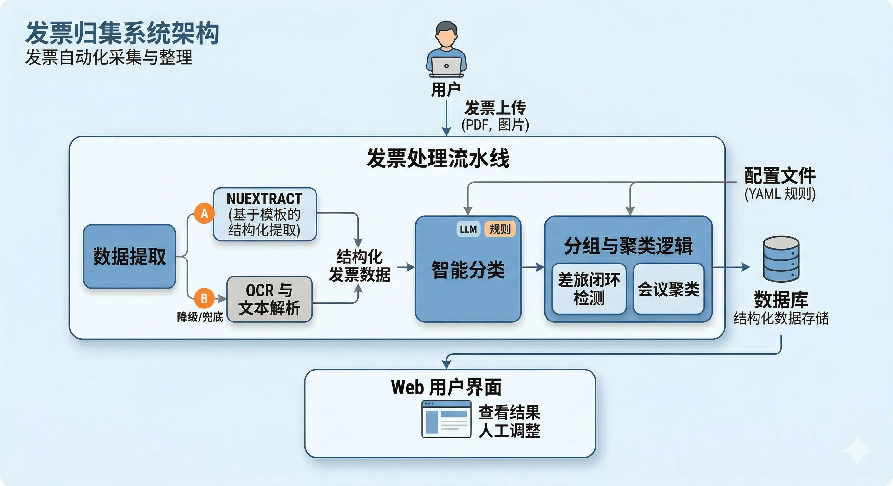
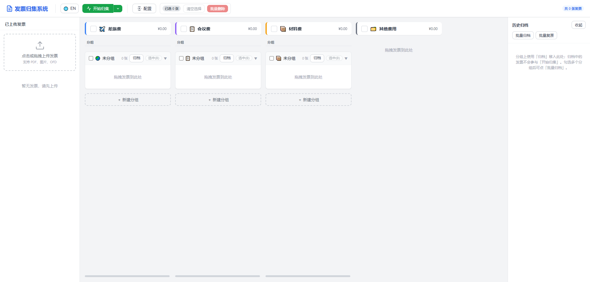
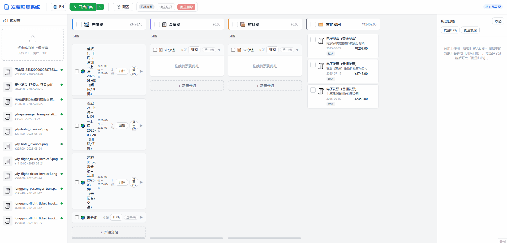

# Invoice Collect / 发票归集系统 🧾

[Language: English | [中文](#zh)]  
*(Note: 建议后续补充英文版，当前以中文版为主)*

一款全栈发票管理系统，支持发票自动提取、智能分类、差旅/会议自动聚类。

License
Python Version
FastAPI

---

## 📖 简介 (Introduction)

**核心痛点解决**：报销贴票、整理发票是一项繁琐的工作。本项目旨在通过 AI 技术与规则引擎，实现发票的自动化结构提取，并根据业务逻辑（如出差行程、会议批次）自动将发票聚类归集，极大地降低人工整理的成本。

## ✨ 核心特性 (Key Features)

- 🧠 **双阶提取**：结合 NuExtract 与 OCR 降级方案（RapidOCR/Tesseract/EasyOCR），精准识别各类发票字段。
- ✈️ **差旅闭环**：基于城市与时间链条，自动将车票、机票、酒店、打车等发票归集为一次“差旅”。
- 📅 **智能聚类**：利用启发式算法（同一销售方+同一天）与 LLM 识别会议等批量发票。
- 🖱️ **人工干预**：支持在 UI 上通过拖拽调整归集结果，满足复杂或异常的报销场景。

## 📸 界面展示 (Showcase / Demo)

### 1. 架构概览



### 2. 主界面与发票上传



### 3. 智能分组与拖拽交互



## 🚀 快速开始 (Quick Start)

### 前置要求 (Prerequisites)

- **Python** >= 3.9
- **API Key** (可选，推荐)：配置兼容 OpenAI 的大模型 API，用于更精准的分类和会议分组。
- **NuExtract** (可选)：如需强大的结构化提取能力，需自备 NuExtract 服务；否则系统将自动降级使用本地 OCR。

### 安装与运行 (Installation)

```bash
# 1. 克隆项目
git clone https://github.com/Gaaaaam/invoice_collect.git
cd invoice_collect

# 2. 安装依赖
pip install -r requirements.txt

# 3. 配置文件准备
# 项目自带默认配置，您可以根据需要修改 config 目录下的文件，如 models.yml, travel.yml 等。
# 重点：配置 config/models.yml 中的大模型与提取服务参数，或者稍后在 UI 中配置。

# 4. 启动服务
python main.py
# 生产环境建议使用: uvicorn main:app --host 127.0.0.1 --port 8088
```

访问 `http://127.0.0.1:8088/` 即可体验。

> **Docker 部署**：项目同样支持 Docker 与 Docker Compose 一键部署，详情可参考旧版文档的 Docker 章节。

## 💡 核心逻辑深度解析 (Feature Deep-dive)

本项目不仅提供了基础设施，更内置了贴合真实报销场景的业务逻辑。

### 1. 差旅闭环检测逻辑

差旅归集不只是简单的时间聚合，系统会结合 `config/travel.yml` 中配置的 `home_city`（常住/出发参照城市）进行**行程链条推导**：

- 当识别到离开 `home_city` 的交通票据（如高铁、机票），即标记为一次差旅的开始。
- 后续的交通票据将作为行程节点串联。
- 当识别到返回 `home_city` 的票据，则视为形成**“闭环”**。
- 系统会将这一时间窗口内的住宿费、市内交通费（打车）自动挂载到该闭环行程组中。

### 2. NuExtract 双阶提取模板

为了应对中国繁杂的票据种类，系统设计了基于 `config/nuextract_templates.json` 的双阶提取流程：

1. **类型判别**：首先判断发票的具体类型（如铁路电子客票、航空行程单等）。
2. **定向抽取**：根据判断出的类型，应用 JSON 模板中对应的高度定制化 schema，从而最大化发挥大模型结构化提取的准确度。并且这种设计极具扩展性，只需修改 JSON 文件即可轻松支持新票种。

## ⚙️ 配置指南 (Configuration)

系统的大部分行为由 `config/` 目录下的 YAML/JSON 文件控制。


| 配置文件                       | 作用说明                                     |
| -------------------------- | ---------------------------------------- |
| `models.yml`               | 配置 LLM 接口地址与密钥、NuExtract 服务地址、OCR 引擎选择等。 |
| `rules.yml`                | 核心分类规则引擎配置。定义“字段包含某字符则归入某类”的规则树。         |
| `categories.yml`           | 定义报销大类（如差旅费、会议费、材料费等）及其是否允许分组。           |
| `travel.yml`               | 差旅特定配置，如核心的 `home_city` 变量。              |
| `nuextract_templates.json` | 定义各类型发票的结构化提取 Schema。                    |


### 配置示例：自定义分类规则 (`rules.yml`)

您可以轻松通过规则引擎将特定发票划入特定类别，以下是一个典型的配置示例：

```yaml
- id: rule_hotel_to_travel
  name: 住宿费归差旅费
  priority: 20
  conditions:
  - field: invoice_type
    match_type: contains
    value: 住宿
  - field: seller_name
    match_type: regex
    value: (酒店|宾馆|旅馆|民宿|客栈)
  condition_logic: OR
  target_category: travel
```

## 🛠 技术栈 (Tech Stack)

- **后端**: FastAPI, SQLAlchemy 2 (async), SQLite
- **前端**: Jinja2, HTML5 / Vanilla JS / CSS3
- **AI / 核心能力**: OpenAI-compatible LLM 接口, NuExtract (异步 HTTP 客户端), RapidOCR/Tesseract/EasyOCR

## 🗺 项目路线图 (Roadmap)

- 支持更多类型的电子票据（如行程单 PDF 直接解析）。
- 增加报销单自动生成导出功能（Excel/PDF）。
- 对接更多国产 LLM 模型（如通义千问、DeepSeek）以提供开箱即用的体验优化。
- *(规划中)* 完善移动端浏览体验。

## 📄 开源协议 (License)

[Apache 2.0 License](LICENSE)